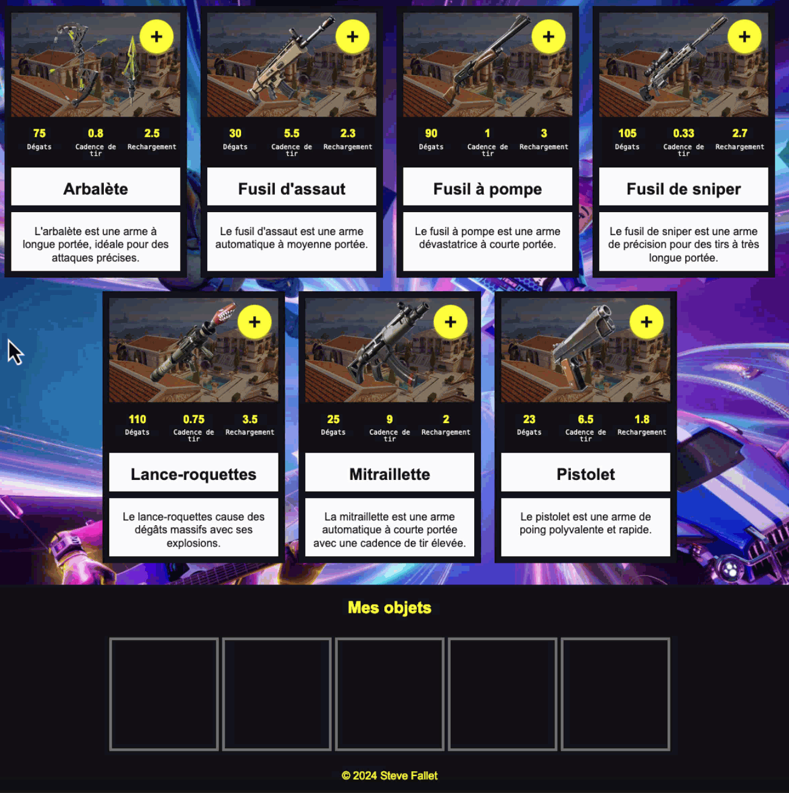

# Exercice Vue Fortnite



## Avant de Commencer
### 1.1 Installer les Paquets
```sh
npm install
```
### 1.2 Démarrer le Serveur de Développement
```sh
npm run dev
```
### 1.3 Vérifier le Fonctionnement du Serveur
Ouvrir le navigateur à l'adresse [http://localhost:3000/](http://localhost:3000/).

## Instructions
Créer une application Vue.js à partir du site _Fortnite - Armes (Battle Royale)_ contenu dans le dossier `_sources/` de ce dépôt.

### 1. Intégration de la Maquette
Intégrer dans l'application Vue.js les éléments suivants de la maquette du dossier `_sources/` :
- Titre du site
- Favicon
- CSS
- Images
- Création des **pages** et **routes** à partir des fichiers HTML :
  - `_sources/index.html` - Accueil
  - `_sources/presentation.html` - Présentation de Fortnite
  - `_sources/nouvelle-carte.html` - Nouvelle Carte

### 2. Découpage en Composants
- Découper le code HTML du fichier `App.vue` en plusieurs composants Vue :
  - `components/PageHeader.vue` contenant le `<header>` du site.
  - `components/PageFooter.vue` contenant le `<footer>` du site.
  - Utiliser le `<router-view>` pour afficher les composants des pages.
- Créer un composant pour chaque page :
  - `pages/Index.vue` - Accueil
  - `pages/Presentation.vue` - Présentation de Fortnite
  - `pages/NouvelleCarte.vue` - Nouvelle Carte
- Modifier les liens du menu de navigation pour utiliser les routes Vue Router.
  - **Petit défit :** Ajouter une classe `active` au lien de la page active avec les fonctionnalités de Vue Router.
- Intégrer le CSS de chaque partie dans le fichier `.vue` correspondant :
  - CSS général dans `App.vue`
  - CSS du `<header>` dans `PageHeader.vue`
  - CSS du `<footer>` dans `PageFooter.vue`
  - CSS des pages dans les fichiers `.vue` correspondants, nécessaire uniquement pour la page d'accueil et sa liste d'armes.

### 3. Affichage des Armes dans `pages/Index.vue`

Utiliser le magasin Pinia et le tableau d'armes, puis parcourir ce tableau avec une boucle `v-for` pour créer un `<li>` pour chaque arme dans la liste `<ul class="liste-armes">`.

Les éléments dynamiques à afficher pour chaque arme sont :
- Nom de l'arme
- Image de l'arme (ne pas oublier de copier les images dans le dossier `public/img/`)
- Description de l'arme
- Dégâts
- Cadence de tir
- Temps de rechargement

####  Exemple d'Utilisation du Magasin armeStore dans App.vue
  Un exemple d'utilisation du magasin `armeStore` est disponible dans `App.vue`. 
  Cet exemple affiche le nom de toutes les armes dans la console.

### 4. Ajout d'une Arme dans _Mes Objets_

#### Création d'une Action pour Ajouter une Arme
Dans le magasin Pinia, créer une action `ajouterArme(arme)` pour ajouter une arme dans le tableau `mesObjets`.

Le paramètre `arme` est l'objet de l'arme à ajouter dans le tableau `mesObjets`.

> On ne peut **pas ajouter plus de cinq armes** dans `mesObjets`.

#### Ajout d'une Arme dans `mesObjets`
Au clic sur le bouton `[+]` d'une arme, celle-ci doit être ajoutée dans le tableau `mesObjets`. Utiliser l'action `ajouterArme(arme)` pour ajouter l'arme dans le tableau.

##### Désactiver le Bouton `[+]`
Après l'ajout d'une arme dans `mesObjets`, désactiver le bouton `[+]` de l'arme en ajoutant un attribut `disabled` au bouton de cette arme.
```html
<button disabled>+</button>
```

Utiliser la méthode `includes()` pour vérifier si une arme est déjà présente dans `mesObjets`.

Exemple d'utilisation de la méthode `includes()` pour vérifier la présence d'une valeur dans un tableau :
```js
let invites = ["Alice", "Bob", "Charlie"];
if (invites.includes("Bob")) {
    console.log("Bob est déjà dans le tableau");
}
```

#### Affichage des Armes dans `mesObjets`
L'objectif est d'afficher les armes ajoutées dans le tableau `mesObjets` dans le `<footer>` de la page. Il faudra donc récupérer le tableau `mesObjets` dans `components/PageFooter.vue`.

##### Version Simple
Dans le `<footer>`, créer une boucle `v-for` qui parcourt le tableau `mesObjets` reçu en tant que propriété et crée un `<li>` avec l'image de l'arme dans la liste `<ul class="mes-objets">`.
```html
<li>
   
</li>
```

###### Désactiver les Boutons `[+]`
Désactiver les boutons `[+]` de toutes les armes lorsque le tableau `mesObjets` contient cinq armes.

##### Version Finale
Dans le `<footer>`, créer une boucle `v-for` qui se répète `5x` pour créer les cinq `<li>` de la liste `<ul class="mes-objets">`.
```vue
<!-- Exemple de boucle v-for affichant 5 paragraphes numérotés de 1 à 5 -->
<p v-for="n in 5" :key="n">{{ n }}</p>
```

À chaque itération, vérifier si une arme est présente à la position correspondante dans le tableau `mesObjets`.
> Au premier tour de la boucle, vérifier si une arme est présente à l'index 0 (n-1) dans `mesObjets`.

Si une arme est présente, afficher l'image de l'arme dans le `<li>` :
```html
<li>
   
</li>
```

Sinon, afficher un `<li>` vide :
```html
<li></li>
```
## Pour les plus motivés
* Retirer une arme de la liste `mesObjets` en double cliquant sur l'arme.
* Ajouter un bouton pour vider la liste `mesObjets`.
* Ajouter une liste déroulante pour trier les armes par dégâts, cadence de tir ou temps de rechargement.

Bonne chance !

Steve Fallet
